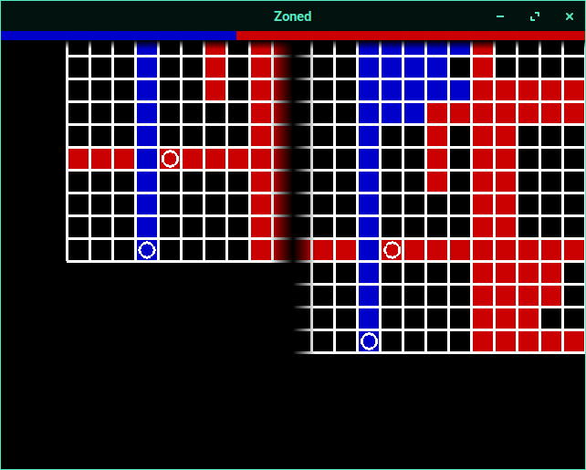

# Zoned
A grid based strategy game where the objective is to capture as many cells as possible. Made using [libGDX](https://github.com/libgdx/libgdx)  
Primarily targeting Android, but should work fine on Desktop as well. Currently supports splitscreen multiplayer as well as cross-platform local network multiplayer

Still a work-in-progress but feel free to fork and/or send in pull requests

Two player splitscreen multiplayer sample screenshot:

